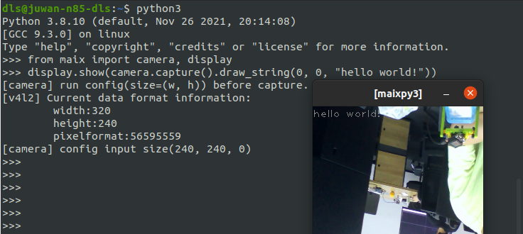

<p align="center">
    
</p>

# MaixPy3   

[](./LICENSE) [](https://badge.fury.io/py/maixpy3)  

MaixPy3 is a Python3 toolkit based on [cpython](https://github.com/python/cpython), which simplifies the development of applications on Linux AI edge devices through Python programming.

### [See the wiki.sipeed.com for more information](https://wiki.sipeed.com/maixpy3)

## Support Jupyter Environment

Install [rpyc_ikernel](https://github.com/sipeed/rpyc_ikernel) kernel in jupyter notebook & lab to get an IDE that can remotely call Python code, videos, and image streaming.


## Installation

- ready linux ubuntu20.04 desktop

```bash
sudo apt update && sudo apt install libjpeg-dev gcc libopencv-dev -qq -y && wget http://mirrors.kernel.org/ubuntu/pool/main/libf/libffi/libffi6_3.2.1-8_amd64.deb && sudo apt install ./libffi6_3.2.1-8_amd64.deb -qq -y

python3 -m pip install pybind11 maixpy3
```

- run this python code

```python3
from maix import camera, display
display.show(camera.capture().draw_string(0, 0, "hello world!"))
```



## Develop

Under `linux x86_64`, use `python3 setup.py build && python3 -m pip install .` to complete the linux package construction.
If you need `.whl` pre-compiled package, please change `build` to `bdist_wheel`.
For other platforms, take the version of `maix_v83x` as an example, match the Python3 + cross-compilation chain of the corresponding platform, and run `python3.8 setup.py build maix_v83x` to complete the construction of the target platform package.

Welcome to provide configurations of different platforms to [MaixPy3/envs/](./envs/) to adapt to the MaixPy3 environment.

| **Platform**      | **Status** |  **Config** | **Progress** | **Toolchain** |
| --------------    | ---------- | ----------- | ------------ | ------------ |
| linux_pc & RPi_2B | working    | [linux_desktop](./envs/linux_desktop.py)  | 70%  | [develop.md](./docs/develop.md) & [maixpy3_build.yml](.github/workflows/maixpy3_build.yml)
| maix_v83x         | working    | [maix_v83x](./envs/maix_v83x.py)    | 99%  | [v83x_linux_x86_python3.8_toolchain](https://github.com/sipeed/MaixPy3/releases/tag/20210613)
| maix_r329         | working    | [maix_r329](./envs/maix_r329.py)    |  99%  | [r329_linux_x86_python3.9_toolchain](https://github.com/sipeed/MaixPy3/releases/tag/20211101)

## License

Copyright (c) Sipeed Corporation. All rights reserved.

Licensed under the MIT license.
